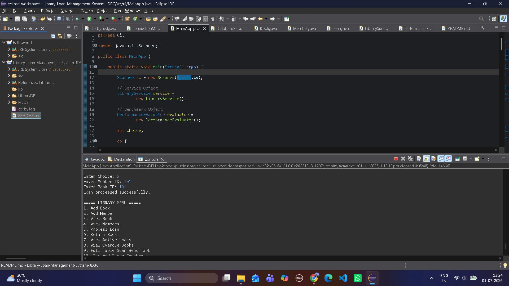
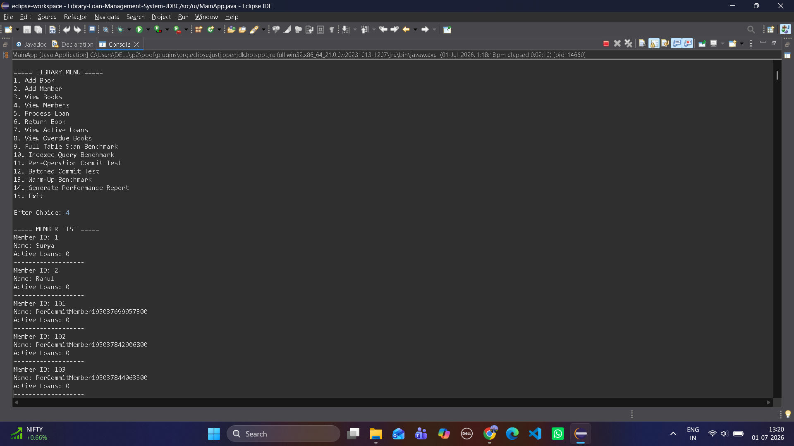
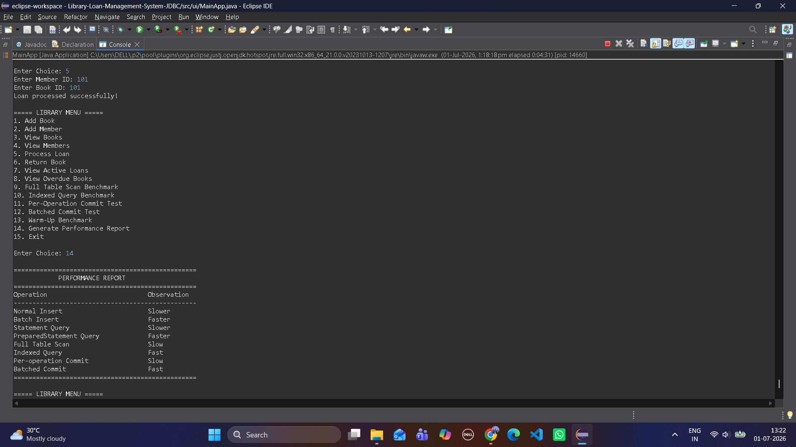

# 📚 End-to-End JDBC Application with Transaction Management & Performance Evaluation (Apache Derby)

## 🚀 Project Overview

This project is a console-based Library Loan Management System developed using Java JDBC and Apache Derby Embedded Database.

The application demonstrates:
- JDBC connectivity
- CRUD operations
- Transaction management
- ACID properties
- PreparedStatement usage
- Savepoints
- Rollback handling
- Batch processing
- Performance benchmarking
- Indexing
- Menu-driven CLI

The project also includes benchmarking modules to compare different JDBC strategies and database optimization techniques.

---

# 🛠️ Technologies Used

- Java
- JDBC
- Apache Derby Embedded Database
- Eclipse IDE

---

# 🏗️ Project Architecture

The project follows layered architecture with separate packages:

## 📦 Packages

| Package | Responsibility |
|---|---|
| connection | Database connection & setup |
| model | Entity classes |
| service | Business logic & transaction handling |
| benchmark | Performance benchmarking |
| ui | Console menu interface |
| util | Utility/helper classes |

---

# 🗄️ Database Used

Apache Derby Embedded Database

JDBC URL:

```java
jdbc:derby:LibraryDB;create=true
```

---

# 📊 Database Schema

## 👥 Members Table

| Column | Description |
|---|---|
| member_id | Primary Key |
| name | Member Name |
| active_loans | Current active loan count |

---

## 📚 Books Table

| Column | Description |
|---|---|
| book_id | Primary Key |
| title | Book Title |
| isbn | Unique ISBN |
| available | Availability status |

---

## 📋 Loans Table

| Column | Description |
|---|---|
| loan_id | Primary Key |
| member_id | Foreign Key |
| book_id | Foreign Key |
| loan_date | Loan issue date |
| return_date | Return date |

---

# ✨ Features Implemented

## 🔗 JDBC Features

- JDBC DriverManager connectivity
- Connection handling
- Statement usage
- PreparedStatement usage
- ResultSet processing

---

## 📝 CRUD Operations

### 📚 Books
- Add Book
- View Books

### 👥 Members
- Add Member
- View Members

### 📋 Loans
- Process Loan
- Return Book
- View Active Loans
- View Overdue Books

---

# 🔒 Transaction Management Features

The project demonstrates explicit transaction management using:

- setAutoCommit(false)
- commit()
- rollback()
- savepoints

---

## 🧪 ACID Properties Demonstrated

### Atomicity
All operations in a transaction succeed together or fail together.

### Consistency
Database integrity is maintained during failures.

### Isolation
Transactions execute independently.

### Durability
Committed data persists permanently.

---

# 🔄 Loan Processing Workflow

The processLoan() transaction performs:

1. Check book availability
2. Insert loan record
3. Update book availability
4. Update member active loan count
5. Commit transaction

If any operation fails:
- rollback() restores database consistency

---

# ↩️ Return Book Workflow

The returnBook() transaction performs:

1. Verify loan exists
2. Update return date
3. Mark book available
4. Reduce active loan count
5. Commit transaction

---

# 💾 Savepoint Demonstration

The project demonstrates partial rollback using savepoints.

If a later operation fails:
- rollback(savepoint) restores only part of the transaction.

---

# ⚡ Performance Benchmarking

The application includes benchmarking modules to compare JDBC strategies.

## 📈 Benchmarks Implemented

### Insert Strategy Benchmark
- Normal Insert
- Batch Insert

Observation:
Batch insert performs significantly faster.

---

### ⚙️ Statement Type Benchmark
- Statement
- PreparedStatement

Observation:
PreparedStatement performs faster due to query precompilation and reuse.

---

### 🔍 Query Strategy Benchmark
- Full Table Scan
- Indexed Query

Observation:
Indexed queries are much faster than scanning the entire table.

---

### ⏱️ Transaction Granularity Benchmark
- Per-operation Commit
- Batched Commit

Observation:
Single batched commit reduces transaction overhead and improves performance.

---

# 🔥 Warm-Up Benchmarking

A warm-up phase is included to:
- stabilize JVM JIT compilation
- warm Derby cache
- improve benchmark consistency

---

# 🖥️ Menu-Driven CLI

The application provides a console-based menu interface for:
- adding books
- registering members
- processing loans
- returning books
- running benchmarks
- generating performance reports

---

# ⚠️ Exception Handling

The project handles:
- duplicate key violations
- foreign key violations
- invalid transactions
- rollback scenarios
- Derby lock issues

---

# 🧹 Resource Management

The project uses:
- try-with-resources
- graceful Derby shutdown

to prevent:
- database lock issues
- memory leaks
- resource leaks

---

# 📋 Sample Performance Observations

| Operation | Observation |
|---|---|
| Batch Insert | Faster |
| PreparedStatement | Faster |
| Indexed Query | Faster |
| Full Table Scan | Slower |
| Batched Commit | Faster |

---

# ▶️ How To Run

## Step 1
Open project in Eclipse IDE.

---

## Step 2
Add Apache Derby JAR files to project build path.

Required libraries:
- derby.jar

---

## Step 3
Run:

```text
ui/MainApp.java
```

---

## Step 4
Use menu-driven interface.

---

# ℹ️ Important Derby Notes

- Derby Embedded Mode allows only one active database instance.
- Graceful shutdown is required to release database locks.
- shutdown=true intentionally throws exception in Derby.

---

# 🚀 Future Improvements

Possible future enhancements:
- GUI version using JavaFX/Swing
- Multi-user concurrency
- Fine calculation for overdue books
- CSV export reports
- Advanced analytics dashboard
- Network-mode Derby deployment

---

# 🎯 Learning Outcomes

This project helped demonstrate:
- JDBC programming
- Database transactions
- ACID properties
- Performance optimization
- Benchmarking techniques
- Indexing concepts
- Exception handling
- Layered software architecture

---

---

# 📸 Application Screenshots

## Main Menu Interface



---

## Loan Processing Transaction



---

## Performance Benchmark Report



---

# 👨‍💻 Author

**Surya Narayan Choudhury**   
**Branch: B.Tech CSE**

Developed as a JDBC Mini Project using Apache Derby Database.
